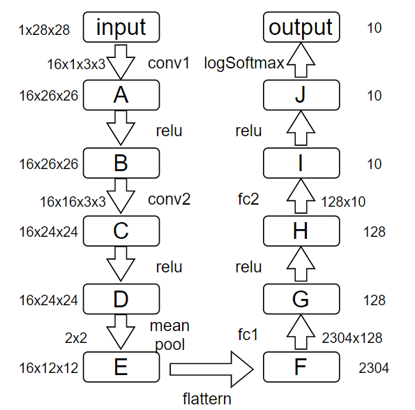
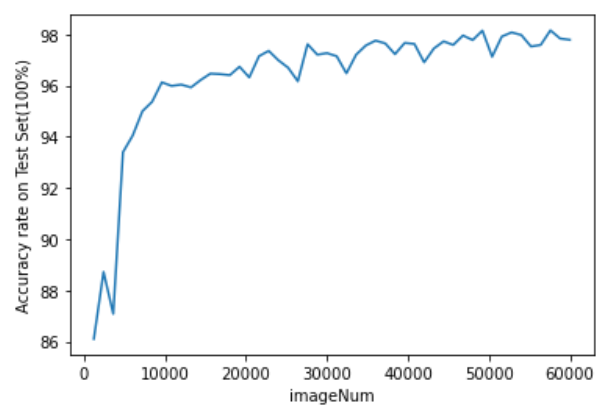
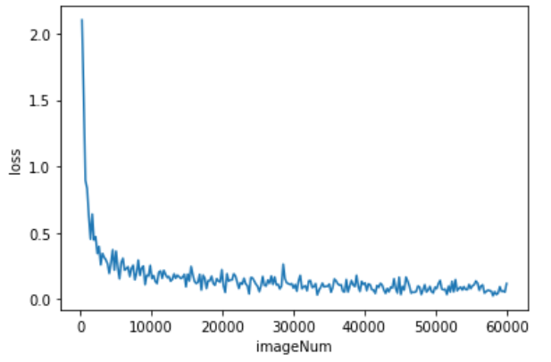

# Convolutional Neural Network(ConvNN) to Solve MNIST

## Features

- **Not dependent on any machine learning framework**

- Achieve about 98% accuracy rate on test set after an epoch about ten minutes

- With simple commands, you can reproduce above-mentioned result or just play with it

## Prepare Data Set

```
make data
```

## Run

> At each run, the standard output will be recorded in the `log` file

### To reproduce result

> To accelrate, only 1200 images were tested at each time

```
make
```

### To play with it
```
make CXXFLAG=-DSHOW
```
After training, you can press enter and you will see the hand-written number, predicted result and output of `J` layer which represents the probability of each number.


## Structure of ConvNN



## Eval About Training CovNN




